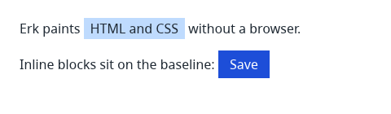

# Erk Engine

```
┌──────────────────────────────────────────────────────┐
│                      ERK ENGINE                      │
│                                                      │
│   HTML/CSS → desktop UI, drawn by Erk itself         │
│   Rust · MIT OR Apache-2.0 · no WebView · no JS core │
└──────────────────────────────────────────────────────┘
```

**Erk** is an embeddable HTML/CSS UI engine for desktop applications, written
in Rust. Your application owns the logic and drives the document; Erk styles
it, lays it out, paints it and reports what the user did. The goal is the
space Sciter has proven, as an open-source engine built on standard CSS.



*Rendered by Erk, not a browser: `cargo run -p erk-renderer --example png`.*

> **Erk is early.** It renders static pages to a window or a PNG. It cannot
> yet be embedded through an API, and does not yet react to input. See
> [current limitations](#current-limitations).

## Why Erk?

- **No WebView, no JavaScript runtime in the core.** Erk is the renderer:
  the same page draws the same pixels on every machine, and the engine core
  ships no script engine. JavaScript is planned as an optional binding,
  off by default.
- **Your language drives the UI.** Rust first; a C ABI, Python and Go are
  planned. The host addresses the document by opaque node ids and sends
  batched changes; Erk sends back events.
- **A core that cannot reach your system.** The engine core does no file,
  network or process I/O and reads no clock or environment variable.
  Resources and time come from the host. CI enforces this.
- **Standard CSS, measured.** A clearly bounded subset of CSS, styled by
  Stylo (Firefox's style engine). What is supported, planned or never
  planned is listed in [docs/css-support.md](docs/css-support.md), every
  supported row names its test, and every reference page is compared with
  Chrome pixel by pixel and box by box.
- **Built on mature Rust components**, with original work where none of
  them reach: html5ever, Stylo, Taffy, Parley and Vello; Erk's own inline
  layout, embedding API, incremental rendering and form controls.

## How Erk compares

Each of these is a good tool; they make different trade-offs.

| | Erk | Tauri | Sciter | Blitz |
|---|---|---|---|---|
| Renderer | Its own: Stylo, Taffy, Parley, Vello | The operating system's WebView (WebView2, WKWebView, WebKitGTK) | Its own, in C++ | Its own: Stylo, Taffy, Parley, Vello |
| Scripting | None in the core; optional binding planned | JavaScript (any web framework) | Built in (JavaScript) | None; driven from Rust (Dioxus) |
| Host languages | Rust; C ABI, Python, Go planned | Rust backend, web frontend | C API, many bindings | Rust |
| CSS | Standard, a documented subset | The WebView's full web platform | Standard CSS plus its own extensions | Standard |
| Same pixels on every OS | Yes (embedded fonts, one CPU renderer) | No: each WebView renders differently | Own renderer; graphics backend varies by platform | Own renderer |
| Licence | MIT OR Apache-2.0 | MIT OR Apache-2.0 | Proprietary | MIT OR Apache-2.0 |
| Maturity | Early | Production | Production | Pre-release |

- **Choose Tauri** to build the UI with the web ecosystem (React, Vue, npm)
  and accept the platform WebView.
- **Choose Sciter** if you need a mature embedded HTML engine today.
- **Choose Blitz** to write the UI in Rust with Dioxus.
- **Erk is for** an HTML/CSS interface driven from Rust, C, Python or Go,
  without a WebView or a JavaScript stack: installers, launchers, tray and
  settings panels, internal tools, industrial panels. Once it is ready.

Erk shares Blitz's foundation and adapts parts of its code (MIT OR
Apache-2.0); the differences are the embedding contract, the host-driven
API and the I/O-free core.

## Architecture

```
host application (Rust; C, Python, Go planned)   logic, state, files
        │   ▲
        │   │  node ids, batched mutations, events
        ▼   │
erk (Rust API) ── erk-ffi (C ABI, erk.h)          planned: M3
        │
engine core: erk-dom · erk-style · erk-renderer   no I/O, no clock
        │
window: winit + softbuffer
```

The document lives on the UI thread; rasterizing runs on its own thread and
receives a plain-data display list. Details: [ARCHITECTURE.md](ARCHITECTURE.md)
and the embedding contract, [p1-contract.md](docs/design/p1-contract.md)
(Turkish).

## Example

What works today: render a page to a PNG
([`crates/erk-renderer/examples/png.rs`](crates/erk-renderer/examples/png.rs)).

```rust
use erk_renderer::render_html;

const PAGE: &str = r#"<!DOCTYPE html>
<style>
  body { margin: 24px; font-family: "Noto Sans"; color: #1f2933 }
  .tag { background: #bfdbfe; padding: 2px 8px }
  .button { display: inline-block; background: #1d4ed8; color: #fff; padding: 6px 14px }
</style>
<p>Erk paints <span class="tag">HTML and CSS</span> without a browser.</p>
<p>Inline blocks sit on the baseline: <span class="button">Save</span></p>"#;

fn main() {
    let frame = render_html(PAGE, 480, 140);
    let png = frame.to_png().expect("the frame has pixels");
    std::fs::write("erk.png", png).expect("erk.png can be written");
}
```

Or open a file in a window:

```sh
cargo run -p erk-shell -- examples/merhaba.html
```

The embedding API arrives in M3. Its shape is set by the
[contract](docs/design/p1-contract.md): the host loads a document, finds
nodes, subscribes to events and sends batched mutations. A counter, the
first interactive demo, is the acceptance test of M2.

## Current limitations

Today Erk does **not**:

- offer an embedding API or C ABI (M3), or handle input and events (M2, M4);
- load images, or paint borders (border widths take space but are not
  drawn) (M1);
- support `vertical-align`, `position`, or verified flexbox (M1);
- load system fonts: text uses the embedded Noto Sans (M1);
- render incrementally: every change redraws the whole page (M5).

Never planned: floats, table layout, multi-column, print, and a
browser-compatible JavaScript environment. The full list is in
[docs/css-support.md](docs/css-support.md).

## Measurements

Measured, not claimed. Windows 11, Intel i7-10750H, CPU rendering
(`vello_cpu`), every frame a full recompute (incremental rendering is M5):

| What | Result |
|---|---|
| Release binary, default profile (Windows) | 14.9 MB; 9.5 MB with `opt-level = "s"` |
| Idle window, private memory | 12.6 MB (small page), 13.0 MB (1000 elements) |
| 1000-element page, full render | first call ~77 ms, then a median of ~53 ms |

The Linux release binary is held under a size budget in CI. Similarity to
Chrome 154 on the reference pages: every element box matches within 1 CSS
pixel on all nine pages, and pixel scores range from 48 % on text-heavy
pages (glyph antialiasing differs) to 100 % on boxes; the scores are in
[expectations.txt](crates/erk-renderer/tests/reference/expectations.txt)
and may only rise unless a written reason says otherwise.

## Roadmap

| Milestone | Scope | Status |
|---|---|---|
| M0 | First pixel | Done |
| M0.5 | The embedding contract | Done |
| M1 | Static UI: inline layout, flexbox, positioning, borders, images, system fonts | In progress |
| M2 | Input, hit testing, scrolling, GPU rendering; the counter demo | Planned |
| M3 | Rust API and C ABI | Planned |
| M4 | Mutable DOM and events; TodoMVC | Planned |
| M5 | Incremental rendering, forms, IME, accessibility | Planned |
| M6 | Bindings: Python, Go, optional JavaScript | Planned |
| M7 | Developer tools, written with Erk | Planned |
| M8 | Packaging, ABI 1.0 | Planned |
| M9–M12 | Compositor, host GPU surfaces, SVG and media, components | Planned |

Every milestone ends with something demonstrable and an acceptance test; the
project gives no dates. Full roadmap: [roadmap.md](docs/plans/roadmap.md)
(Turkish).

## Design philosophy

- **A rule not enforced by CI does not exist.** Architectural rules (no
  `unsafe` outside named crates, no I/O in the core, plain-data messages
  between threads) are checked by guard scripts, each tried against a
  deliberate violation.
- **Tests, not eyes.** Rendering is checked by golden images and by
  comparison with Chrome; a test must break when what it protects breaks.
- **Measure before promising.** Size, memory and frame-time numbers come
  from measurements on a named machine, never from targets.
- **A subset, not a dialect.** Erk leaves out parts of CSS, but what it
  supports behaves as the standard says.

## Building

Requirements:

- A recent stable [Rust toolchain](https://rustup.rs/); the exact version is
  pinned in `rust-toolchain.toml`
- On Windows: the MSVC Build Tools with the C++ workload
- Python 3 (used by Stylo's build script)

```sh
cargo build
cargo test
```

Open a local HTML file in a window, or paint it to a PNG:

```sh
cargo run -p erk-shell -- examples/merhaba.html
cargo run -p erk-shell -- --screenshot out.png examples/merhaba.html
```

## Project layout

```
crates/
  erk-shell/     window, event loop, the demo host
  erk-renderer/  layout, display list, paint; the renderer thread
  erk-style/     CSS styling with Stylo
  erk-dom/       arena DOM and HTML parsing
docs/
  design/        architecture decisions (Turkish)
  plans/         roadmap and milestone plans (Turkish)
  css-support.md what CSS works, is planned, or is not planned
```

## Contributing

Contributions are welcome! Please read [CONTRIBUTING.md](CONTRIBUTING.md) and our
[Code of Conduct](CODE_OF_CONDUCT.md) first.

## License

Erk Engine is dual-licensed under either:

* MIT License ([LICENSE-MIT](LICENSE-MIT) or http://opensource.org/licenses/MIT)
* Apache License, Version 2.0 ([LICENSE-APACHE](LICENSE-APACHE) or http://www.apache.org/licenses/LICENSE-2.0)

at your option.

The embedded Noto Sans font files in `crates/erk-renderer/assets/fonts` are
licensed under the [SIL Open Font License 1.1](crates/erk-renderer/assets/fonts/OFL.txt).

### Contribution

Unless you explicitly state otherwise, any contribution intentionally submitted
for inclusion in the work by you, as defined in the Apache-2.0 license, shall be
dual licensed as above, without any additional terms or conditions.
